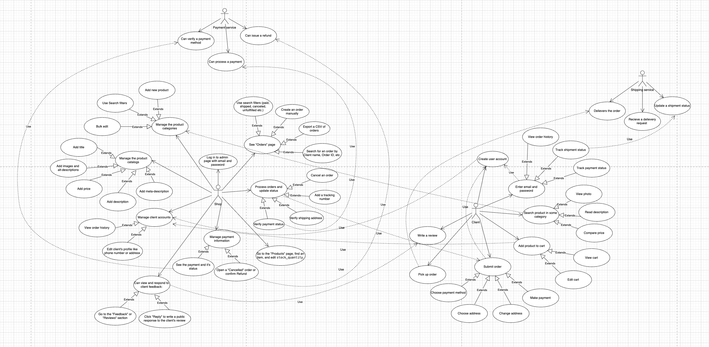

**Requirements**

# 1.Client

1.Can log in to account

2.Can look through items

3.Can order items

4.Can pay for the order

5.Can change address or add another

6.Can track order details

7.Can leave feedback

# 2.Shop

8.  Can provide secure authorization and data protection for clients.

9.  Can manage the product catalog (add, edit, delete products)

10. Can manage product categories (add, edit, delete categories)

11. Can view and filter the list of all client orders

12. Can process orders and update their status (e.g., "Pending", "Processing", "Shipped")

13. Can manage product inventory and stock levels

14. Can view and manage client accounts (e.g., view order history, edit contact info)

15. Can manage payment information (e.g., confirm payment, process refunds)

16. Can manage shipment details (e.g., add tracking numbers)

17. Can provide delivery service

18. Can view and respond to client feedback

19. Can generate sales and inventory reports

**Functional Requirements ↔ Use Cases**

